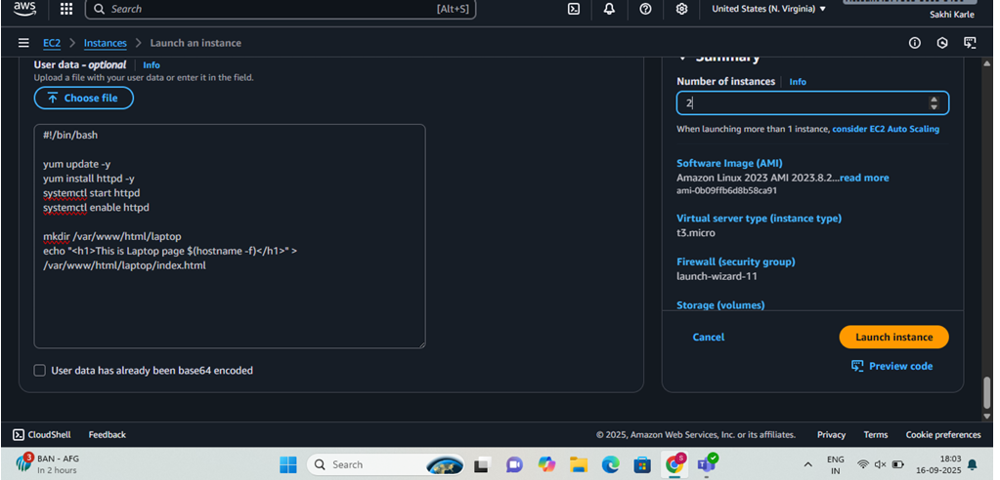
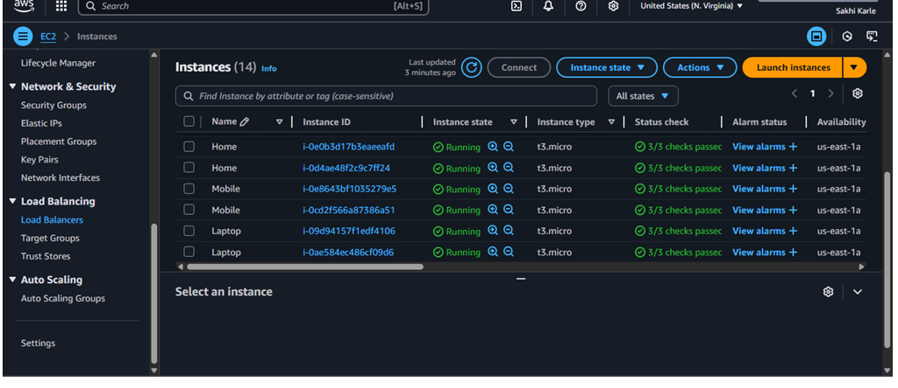
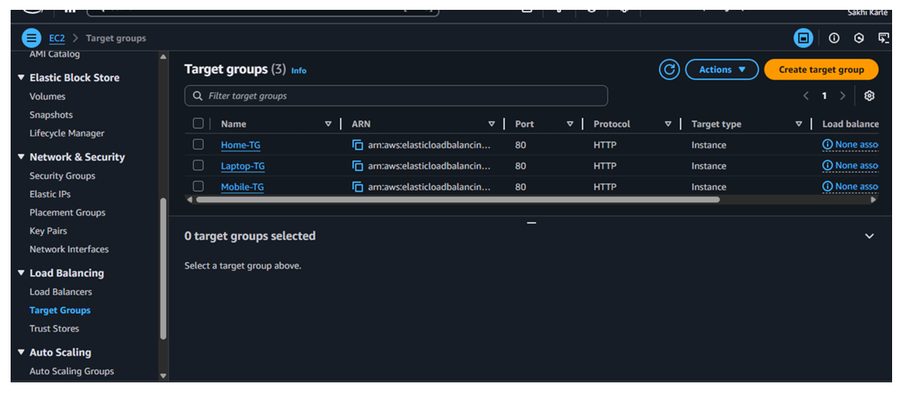
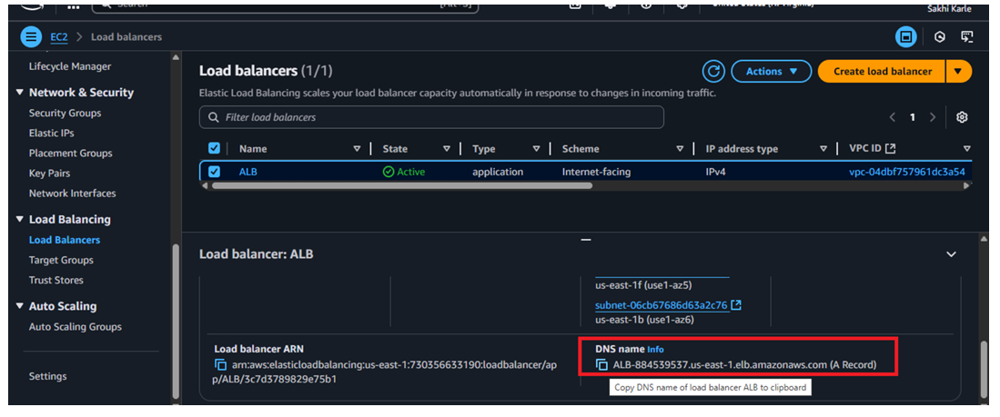
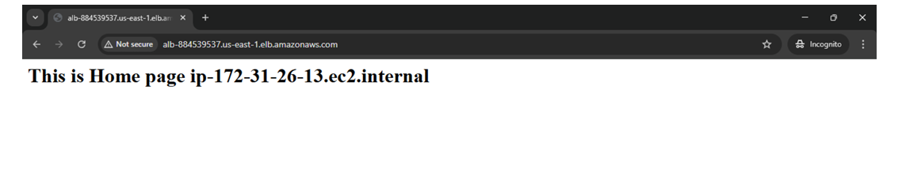
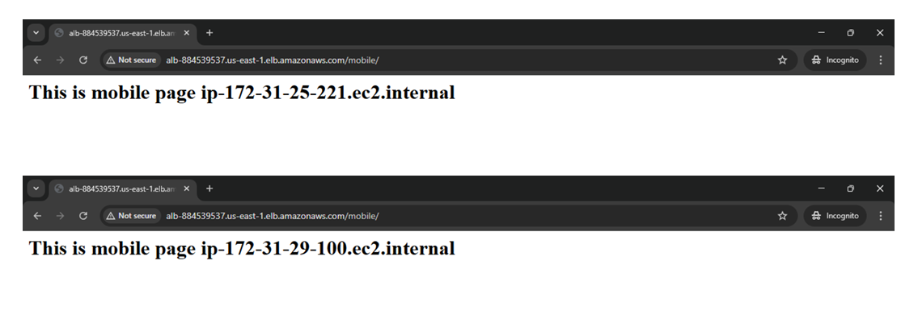

# Application Load Balancer with Multiple EC2 instances

## Introduction
 This project demonstrate the deployment of a Load Balancer that distributes traffic across multiple EC2
 instance. The setup ensures high avaialability, scalability, fault tolerance by balancing requests to

 * Home Page -> 2 EC2 Instances
 * Laptop Page -> 2 EC2 Instances
 * Mobile Page -> 2 EC2 Instance

 ## Architecture

 The setup includes:
 1. Application Load Balancer (ALB) - Distributes incoming traffic.
 2. Target Groups - Separate target groups for Home, Laptop, and Mobile Pages.
 3. EC2 Instance - 6 instances running simple HTML pages

  # Setup Steps
 ## Steps for Deployment   
### Step1: launch the 6 instance home, laptop, mobile  
   •	Creating 2 instances of home.  
   •	Creating 2 instances of laptop.  
   •	Creating 2 instances of mobile.

   # Add the script in User Data while launching home instance  

# Add the script in User Data while launching laptop instance  

# Add the script in User Data while launching mobile instance  

 # Here, a total of 6 EC2 instances are successfully launched

 
  ## Step-2 Create Target Groups
   Create 3 target groups in AWS console and Register each EC2 instance to its respective target group
   
 # Step-3 Create Application Load Balancer
 ## Go to EC2 -> Load Balancer -> Create Application Load Balancer, then attach the 3 target groups, configure listener (HTTP:80) to forward requests

# Step-4 Test the Load Balancer
## Copy the DNS name of the ALB,then open in broser -> refresh multiple times. you should see responses from Home, Laptop, and Mobile alternately

# outpute of home

# output of laptop 

# output of mobile

# Summary
  This Project demonstrate Deployed an AWS Application Load Balancer to distribute traffic across three
 Amazon Linux EC2 instances(Home, Laptop, Mobile). Each instance uses a User Data script with yum update to
 install and start Apache, then serve a custom HTML page showing its hostname. The ALB listener on HTTP (80)
 forwards requests to three target groups, delivering balanced responses from all servers.